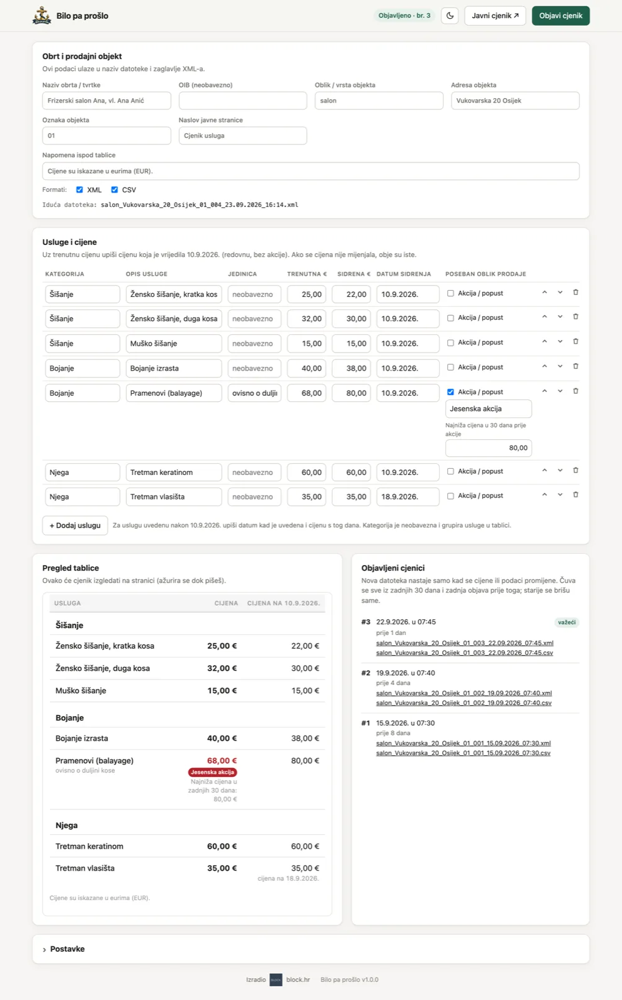
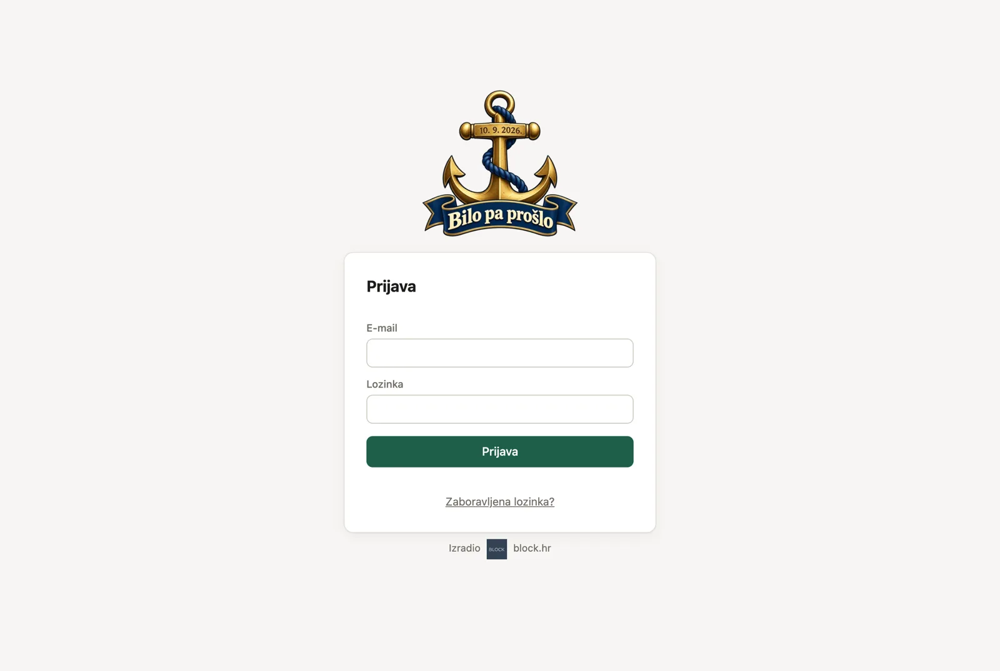
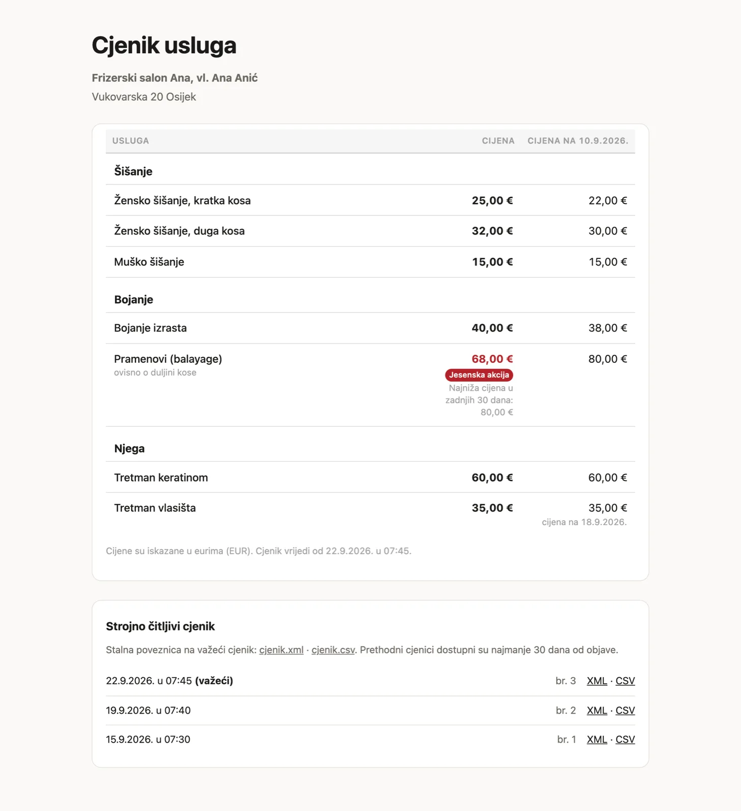
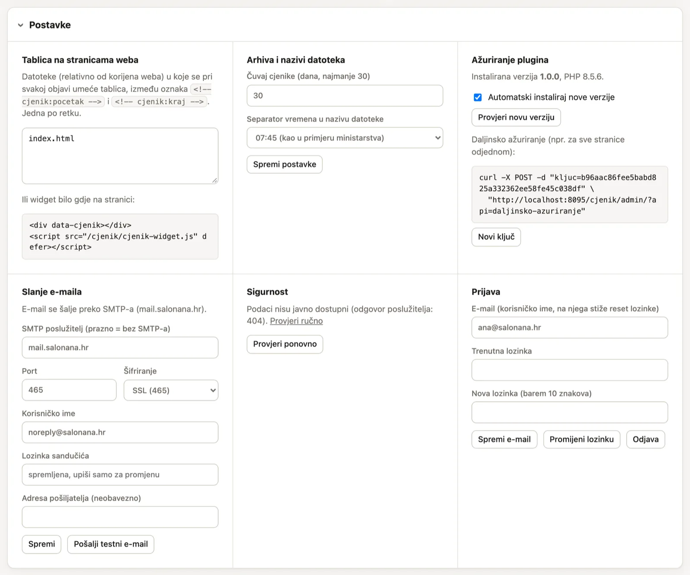
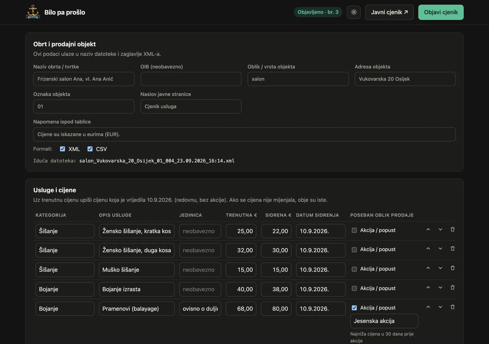
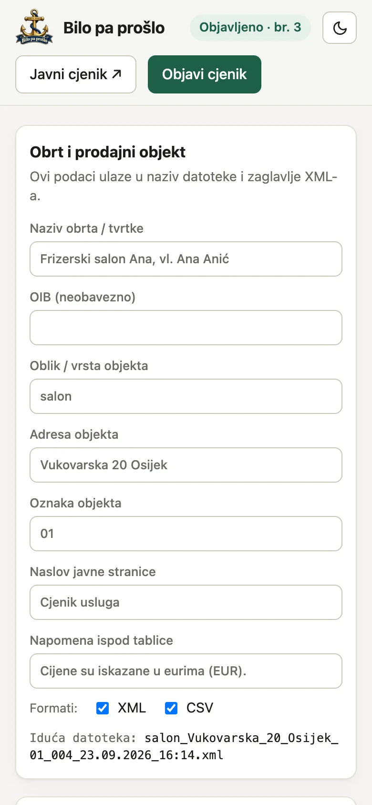
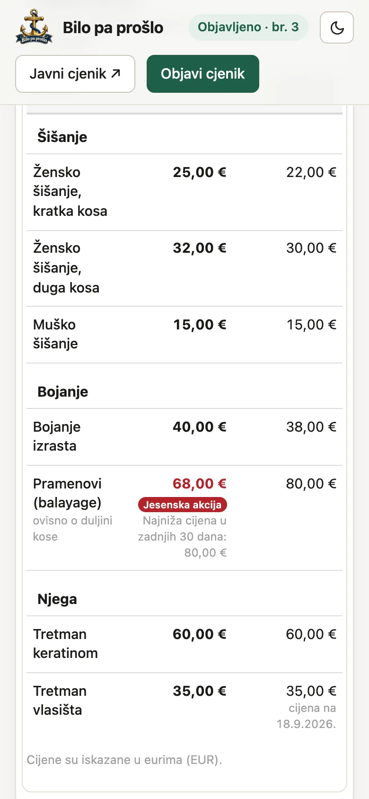

<p align="center"></p>

# Bilo pa prošlo

**Cjenik usluga sa sidrenim cijenama (10.9.2026.). PHP plugin za web stranice.**

<a href="https://block.hr"></a>

Autor: **[BLOCK](https://block.hr)**, web stranice po mjeri i privatni hosting.

Plugin za objavu cjenika usluga prema odlukama iz NN 101/26 koje vrijede od 1. listopada 2026.:

- **dodatna (sidrena) cijena** na dan 10. rujna 2026. uz trenutnu cijenu, u istoj tablici,
- **strojno čitljivi cjenik** (XML, po želji i CSV) s nazivom datoteke kakav traži ministarstvo,
- **arhiva cjenika** koja prethodne cjenike čuva najmanje 30 dana, a starije **briše sama**.

Sve radi na hostingu stranice. Klijent se prijavi u preglednik, upiše usluge i cijene i klikne *Objavi*. Ništa ne mora uploadati ni instalirati. Plugin se ažurira sam s GitHuba.

**Zahtjevi:** PHP 7.4 ili noviji (radi na običnom shared hostingu) i PHP modul `zip` (za ažuriranje). Baza nije potrebna. Stranica može biti potpuno statična (HTML); PHP treba samo mapi `cjenik/`.

## Kako izgleda

<p align="center"></p>

Usluge, trenutne cijene i cijene na 10.9.2026. upisuju se u tablicu. Pregled pokazuje kako će cjenik izgledati na stranici, a desno je arhiva objavljenih XML-ova.

<table>
<tr>
<td width="50%"><br><sub>Prijava e-mailom i lozinkom, uz zaboravljenu lozinku</sub></td>
<td width="50%"><br><sub>Javna stranica cjenika s arhivom XML-ova</sub></td>
</tr>
<tr>
<td width="50%"><br><sub>Postavke: umetanje u stranice, arhiva, ažuriranje, e-mail, sigurnost</sub></td>
<td width="50%"><br><sub>Tamna tema (prekidač u zaglavlju)</sub></td>
</tr>
</table>

<p align="center">

&nbsp;&nbsp;

<br><sub>Na mobitelu</sub>
</p>

## Preuzimanje

**[⬇ Preuzmi Bilo pa prošlo (zadnja verzija)](https://github.com/aureldelic/bilo-pa-proslo/releases/latest/download/bilo-pa-proslo.zip)**

```
https://github.com/aureldelic/bilo-pa-proslo/releases/latest/download/bilo-pa-proslo.zip
```

Adresa uvijek vodi na zadnju verziju. Za instalaciju se koristi samo `bilo-pa-proslo.zip`, a ne automatski paketi *Source code* sa stranice izdanja.

## Instalacija (jednom po stranici)

1. Prenesi `bilo-pa-proslo.zip` u korijen web stranice (`public_html`, `www`…) i raspakiraj ga, tako da nastane mapa `cjenik/` i postoji `https://stranica.hr/cjenik/admin/`.
   - **cPanel / Plesk:** u File Manageru uploadaj zip, pa desni klik → *Extract*.
   - **FTP:** raspakiraj na računalu i prenesi cijelu mapu `cjenik/`.
   - **SSH:**
     ```bash
     cd public_html && curl -L -o bilo-pa-proslo.zip https://github.com/aureldelic/bilo-pa-proslo/releases/latest/download/bilo-pa-proslo.zip && unzip bilo-pa-proslo.zip && rm bilo-pa-proslo.zip
     ```
2. **Odmah** otvori `https://stranica.hr/cjenik/admin/` i upiši **e-mail i lozinku klijenta**. Dok to nije napravljeno, pristup može preuzeti bilo tko tko otvori tu adresu. E-mail je korisničko ime, a na njega stiže poveznica za novu lozinku.
3. **Slanje e-maila.** Plugin provjeri može li hosting slati mail preko PHP `mail()` i upozori ako ne može. Upiši SMTP podatke nekog sandučića (npr. `noreply@domena.hr`) i klikni *Spremi i pošalji testni e-mail*. Korak se može preskočiti. Ako hosting nema `mail()`, reset lozinke tada neće raditi dok se SMTP ne podesi.
4. Pristupne podatke daj klijentu. Klijent može sam promijeniti i e-mail i lozinku u *Postavke → Prijava*.
5. Po želji u *Postavke → Tablica na stranicama weba* upiši HTML stranice u koje se tablica umeće (vidi niže).

Na instalacijskom ekranu plugin javlja ako ne može pisati u svoje mape ili ako su podaci javno dostupni.

## Kako klijent radi

Na adresi `https://stranica.hr/cjenik/admin/` se prijavi e-mailom i lozinkom i uredi:

- **Obrt i objekt:** naziv, oblik objekta (salon, servis, ured…), adresa i oznaka. Ti podaci ulaze u naziv datoteke.
- **Usluge:** opis, trenutna cijena i cijena na 10.9.2026. Kad se upiše trenutna cijena, sidrena se predloži sama. Neobavezno se dodaju kategorija, jedinica i akcija.
- **Uvoz:** standardizirani Excel (`.xlsx`) ili CSV može zamijeniti sve stavke u nacrtu. Datoteka se obrađuje iz privremene upload putanje i ne sprema se na web. Uvoz ne objavljuje cjenik dok se ne klikne *Objavi*.
- **Objavi cjenik:** nastaje novi XML, osvježi se javna stranica, umetne se tablica u stranice weba i obrišu se stari XML-ovi.

Izmjene se automatski spremaju kao nacrt. Javno se ništa ne mijenja dok se ne klikne *Objavi*.

**Tema:** prekidač svijetla/tamna u zaglavlju mijenja izgled sučelja i javne stranice `/cjenik/` (zadano je svijetla). Tablica umetnuta u stranice weba preuzima boje same stranice.

## Što nastaje na stranici

```
cjenik/
├── index.html            javna stranica: tablica cijena i popis XML-ova
├── cjenik.xml            stalna poveznica na važeći cjenik
├── cjenik.csv            (ako je uključen CSV)
├── tablica.html          fragment tablice za widget
├── cjenik-widget.js      widget za ugradnju u stranice
├── arhiva/
│   ├── salon_Vukovarska_20_Osijek_01_001_01.10.2026_07:45.xml
│   └── salon_Vukovarska_20_Osijek_01_002_15.10.2026_07:30.xml
├── admin/                sučelje (prijava lozinkom)
├── _sustav/              kod plugina: mijenja ga ažuriranje
└── _podaci/              podaci, lozinka i nacrt: ažuriranje ga nikad ne dira
```

### Naziv datoteke

Prema pojašnjenju Ministarstva gospodarstva:
`oblik_adresa_oznaka_brojpohrane_DD.MM.GGGG_HH:MM`

- Razmaci postaju `_`, a znakovi `/ \ : * ? " < > |` unutar podataka postaju `-`.
- Broj pohrane je redni broj objave.
- Separator vremena (`:`, `-` ili `.`) mijenja se u postavkama.

### Kada nastaje nova datoteka

Nova XML datoteka nastaje **samo kad se nešto promijeni**: cijena, sidrena cijena, akcija, opis ili podaci o objektu. Objava bez promjena ne dira XML.

### Arhiva i automatsko brisanje

Čuva se:

- sve objavljeno u zadnjih 30 dana,
- **zadnja objava prije te granice**, jer je vrijedila na početku razdoblja, pa je najstariji XML uvijek star barem 30 dana,
- uvijek važeći cjenik.

| Situacija | Što ostaje |
|---|---|
| Jedna objava prije 90 dana, bez promjena | ta jedna (važeća) |
| Promjena svaki dan 40 dana | zadnjih 30 + jedna s granice (31) |
| Objave prije 100, 60 i 5 dana | ona od prije 60 i ona od prije 5 dana |

Starije datoteke plugin briše sam na serveru: pri svakoj objavi i pri svakom otvaranju sučelja. Razdoblje se može produljiti u postavkama (30–365 dana).

## Sadržaj cjenika usluga

### Format za uvoz

Prvi radni list (po mogućnosti nazvan `Import`) mora u prvom retku imati ova zaglavlja:

`naziv_usluge`, `kategorija`, `jedinica_mjere`, `maloprodajna_cijena`, `naziv_posebnog_oblika_prodaje`, `najniza_cijena_30_dana`, `dodatna_cijena`, `datum_dodatne_cijene`, `sifra`.

Obavezni su naziv, maloprodajna cijena, dodatna cijena i datum dodatne cijene. `sifra` je stabilan identifikator; ako je prazna, plugin zadržava postojeću šifru stavke s istom kategorijom, nazivom i jedinicom ili generira novu.

Poseban oblik prodaje određuje se automatski:

- Prazan `naziv_posebnog_oblika_prodaje` znači redovnu prodaju bez akcije ili popusta.
- Popunjen naziv automatski uključuje posebni oblik prodaje. Naziv treba jasno opisati ponudu, npr. `Ljetna akcija`, `Popust 20%` ili `Paket 3 za 2`. `maloprodajna_cijena` je cijena koju kupac tada plaća.
- Za aktivnu ponudu u `najniza_cijena_30_dana` upisuje se najniža cijena koja je vrijedila u 30 dana prije početka ponude. Polje može ostati prazno samo ako je plugin može izračunati iz prethodnih objava iste stavke.

Stariji CSV izvoz sadrži i stupac `poseban_oblik_prodaje` (`DA`/`NE`). Importer ga i dalje prihvaća, ali kad je naziv ponude popunjen, naziv ima prednost i ponuda se automatski smatra aktivnom.

Uvoz prima najviše 2 MB i 2000 stavki. XLSX se čita bez raspakiravanja u javnu mapu, uz ograničenje broja i ukupne raspakirane veličine ZIP dijelova. Privremenu upload datoteku PHP uklanja nakon zahtjeva.

Prema pojašnjenju ministarstva (točka 2.5.):

| Polje | U sučelju | XML |
|---|---|---|
| Naziv usluge | Opis usluge | `<naziv>` |
| Maloprodajna cijena | Trenutna € | `<maloprodajnaCijena>` |
| Poseban oblik prodaje i naziv | Akcija / popust + naziv | `<posebanOblikProdaje primijenjen="da">` |
| Dodatna cijena na dan sidrenja | Sidrena € + datum | `<dodatnaCijena datum="2026-09-10">` |

- **Nove usluge uvedene nakon 10.9.2026.:** kao sidrena cijena upisuje se cijena s kojom je usluga uvedena i datum uvođenja.
- **Usluge bez fiksne cijene:** objavljuju se elementi od kojih se cijena formira (npr. *Rad servisera, po satu*).
- **Akcija:** najniža cijena u 30 dana prije akcije izračuna se sama iz prethodnih objava, a može se upisati i ručno.

Struktura XML-a zasad nije propisana. Ako ministarstvo objavi shemu, mijenja se `cjenik/_sustav/lib/Formati.php`, a nova verzija dođe na sve stranice kroz ažuriranje.

## Tablica na stranicama weba

**1. Umetanje pri objavi (preporučeno: bez JavaScripta i vidljivo tražilicama).** U HTML stranice dodaj oznake:

```html
<!-- cjenik:pocetak -->
<!-- cjenik:kraj -->
```

U sučelju *Postavke → Tablica na stranicama weba* upiši putanje od korijena weba, na primjer `index.html` ili `usluge/index.html`. Pri svakoj objavi sadržaj između oznaka zamijeni se svježom tablicom. PHP mora imati dozvolu pisanja u te datoteke.

**2. Widget.**

```html
<div data-cjenik></div>
<script src="/cjenik/cjenik-widget.js" defer></script>
```

**3. Poveznica** na `/cjenik/`.

Tablica preuzima font i boju teksta od stranice. Boje se mijenjaju CSS varijablama:

```css
.cjenik {
  --cjenik-akcent: #a0522d;        /* akcijska cijena i oznaka akcije */
  --cjenik-rub: #e5e0d8;
  --cjenik-blago: #7a746b;
  --cjenik-pozadina-zaglavlja: #f4f1ec;
}
```

## Sigurnost

- **Lozinka za prijavu** sprema se samo kao hash (`password_hash`). Poveznica za novu lozinku čuva se samo kao SHA-256 hash.
- **`_podaci/` i `_sustav/`** zaštićeni su preko `.htaccess` (Apache). Podaci su k tome spremljeni kao `.php` datoteke koje počinju s `<?php exit;`, pa nisu čitljivi preko weba ni na nginxu.
- **Provjera zaštite:** pri instalaciji i pri svakom otvaranju sučelja plugin preko vlastite javne adrese pokuša pročitati kontrolnu datoteku `_podaci/provjera.php`. Ako je njezin sadržaj vidljiv, prikaže se crveno upozorenje s uputom za popravak.
- **SMTP lozinka** mora ostati čitljiva da bi se plugin mogao prijaviti na mail server. Nikad se ne šalje u preglednik. Preporuka je koristiti poseban sandučić (`noreply@…`) ili SMTP ključ servisa za slanje, a ne glavni mailbox.
- Prijava je zaštićena od pogađanja (5 pokušaja, pa blokada 15 minuta), a sve radnje u sučelju od CSRF-a.

## Zaboravljena lozinka

Na ekranu za prijavu je poveznica **Zaboravljena lozinka?**. Klijent upiše svoj e-mail i dobije poveznicu za novu lozinku.

- Poveznica vrijedi **1 sat**, može se iskoristiti samo jednom i odjavljuje sve ostale prijave.
- Odgovor na ekranu je uvijek isti, pa se ne može provjeriti koji je e-mail registriran.
- Nova poveznica može se zatražiti najviše jednom u 5 minuta.
- Adresa u poveznici je ona spremljena pri instalaciji i prijavi, a ne ona iz zahtjeva. Tako je nitko ne može preusmjeriti na svoju domenu.

**Bez pristupa e-mailu:** preko FTP-a obriši `cjenik/_podaci/postavke.php` i ponovno otvori `/cjenik/admin/` za novu instalaciju. Cijene i arhiva ostaju, a generira se i novi ključ za daljinsko ažuriranje.

## Slanje e-maila

Mail ide preko **SMTP-a** ako je podešen (pri instalaciji ili u *Postavke → Slanje e-maila*). Inače ide preko PHP `mail()` s adrese `noreply@domena-stranice`. Ako ne radi ništa, klijent dobije poruku da se javi webmasteru, a točan razlog zapiše se u PHP error log.

SMTP klijent je ugrađen, bez vanjskih biblioteka, i podržava SSL (port 465), STARTTLS (587) i vezu bez šifriranja. Česti podaci:

| Sandučić | Poslužitelj | Port / šifriranje | Napomena |
|---|---|---|---|
| Hosting (cPanel, Plesk…) | `mail.domena.hr` | 465 / SSL | korisnik je cijela e-mail adresa |
| Gmail / Google Workspace | `smtp.gmail.com` | 587 / STARTTLS | treba *lozinka aplikacije* |
| Microsoft 365 | `smtp.office365.com` | 587 / STARTTLS | SMTP AUTH mora biti dopušten |

Gumb *Pošalji testni e-mail* šalje poruku na e-mail korisnika i prikaže točnu grešku poslužitelja ako slanje ne uspije.

## Ažuriranje plugina

Instalacije preuzimaju nove verzije na tri načina:

- **Automatski:** kad klijent otvori sučelje, a u postavkama je uključeno *Automatski instaliraj nove verzije* (zadano). Provjera se radi najviše svakih 6 sati.
- **Ručno:** gumb *Ažuriraj sada* u sučelju.
- **Daljinski, za sve stranice odjednom:** svaka instalacija ima svoj ključ (*Postavke → Ažuriranje plugina*). Popis stranica upiši u `stranice.txt`:

  ```
  https://salonana.hr/cjenik/admin/ 3f9c2a7e5b1d8046c3e9a2f7b5d1c8e4a6f0b2d9
  https://servis-ivo.hr/cjenik/admin/ 4f0c...
  ```

  pa pokreni:

  ```bash
  alati/azuriraj-sve.sh stranice.txt
  ```

Ažuriranje mijenja samo `_sustav/` i `admin/`. Nova verzija se raspakira pokraj stare i zamijeni tek kad je potpuna. Podaci, lozinka i objavljeni cjenici ostaju netaknuti.

Za ažuriranje repozitorij mora biti **javan**. Kod nije tajan, a podaci klijenata nikad nisu u repozitoriju. Za privatni repozitorij upiši GitHub token u `_podaci/postavke.php` (ključ `githubToken`).

## Razvoj

Nova verzija objavljuje se tagom:

```bash
nova_verzija="1.1.0"
printf '%s\n' "$nova_verzija" > cjenik/_sustav/VERZIJA
git commit -am "Verzija $nova_verzija"
git tag "v$nova_verzija"
git push origin main "v$nova_verzija"
```

GitHub Action pokrene testove na PHP 7.4 i 8.3, napravi `bilo-pa-proslo.zip` i objavi izdanje. Ako testovi ne prođu, izdanje se ne objavljuje.

Lokalno:

```bash
php tests/testovi.php        # testovi

# isprobavanje: mapa primjer-stranica/ nije u repozitoriju
mkdir -p primjer-stranica && echo '<h1>Primjer</h1><!-- cjenik:pocetak --><!-- cjenik:kraj -->' > primjer-stranica/index.html
rsync -a --exclude _podaci --exclude arhiva cjenik/ primjer-stranica/cjenik/
PHP_CLI_SERVER_WORKERS=4 php -S 127.0.0.1:8089 -t primjer-stranica   # http://127.0.0.1:8089/cjenik/admin/
```

`PHP_CLI_SERVER_WORKERS` je potreban jer provjera zaštite šalje zahtjev istom serveru, a ugrađeni PHP server inače obrađuje jedan zahtjev odjednom.
